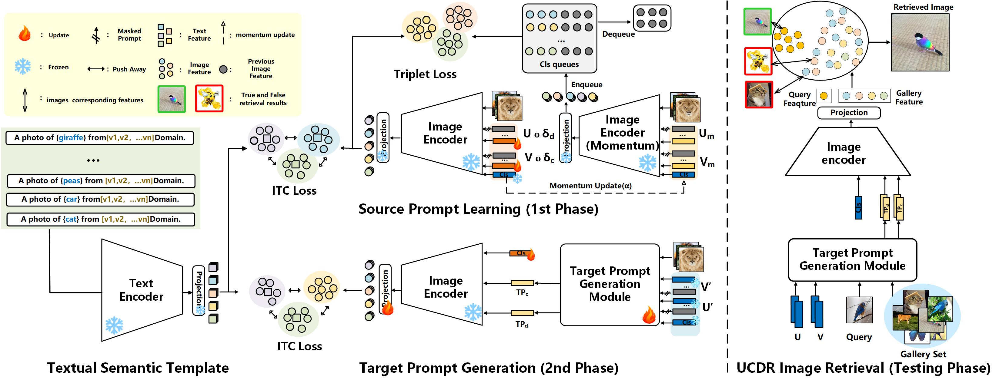

# UCDR-Adapter: Exploring Adaptation of Pre-Trained Vision-Language Models

> Absract:Universal Cross-Domain Retrieval (UCDR) aims to retrieve relevant images without relying on semantic labels, enabling generalization to queries from unseen domains and classes. However, achieving robust generalization is challenging, requiring the acquisition of domainagnostic yet semantically discriminative features. Recent approaches have used pre-trained visual-language models but suffer from over-reliance on scarce unrepresentative training data. To address this, we propose UCDR-Adapter,which augments a base model with adapters and a two-phase training strategy. 1) A key invention is the integration of a learnable Textual Semantic Template to incorporate both top-down class semantics and bottom-up domain visual knowledge. Further, Class & Domain Prompts are optimized via Momentum Updated Prompts and dual losses for aligned multimodal representations. 2) The Target Prompt Generation phase then attends over masked source prompts to simulate generalization. In the testingnphase, only the image branch is used with generated TargetnPrompts for retrieval without textual cues. Experiments validate UCDR-Adapter’s effectiveness, significantly outperforming state-of-the-art with gains on UCDR (+16.84%),UcCDR (+11.21%), and UdCDR (+19.08%)




## Requirements

```bash
conda env create -f UCDR_Adapter.yaml
conda activate UCDR_Adapter
```

## Data Preparation

1. Download DomainNet, Sketchy and TU-Berlin using scripts in `./UCDR_Adapter/downloads`.

   ``` bash
   cd ./UCDR_Adapter/downloads
   bash download_domainnet.sh
   bash download_sketchy.sh
   bash download_tuberlin.sh
   ```

2. The directory is expected to be in the structure below:

   ```python
   ├── DomainNet
   │   ├── clipart # images from clipart domain
   │   ├── clipart_test.txt # class names for testing
   │   ├── clipart_train.txt # class names for training
   │   ├── down.sh
   │   ├── infograph
   │   ├── infograph_test.txt
   │   ├── infograph_train.txt
   │   ├── painting
   │   ├── painting_test.txt
   │   ├── painting_train.txt
   │   ├── quickdraw
   │   ├── quickdraw_test.txt
   │   ├── quickdraw_train.txt
   │   ├── real
   │   ├── real_test.txt
   │   ├── real_train.txt
   │   ├── sketch
   │   ├── sketch_test.txt
   │   └── sketch_train.txt
   ├── Sketchy
   │   ├── extended_photo
   │   ├── photo
   │   ├── sketch
   │   └── zeroshot1
   └── TUBerlin
       ├── images
       └── sketches
   ```

## Run


```bash
# DomainNet
python3 main.py -data DomainNet -hd sketch -sd quickdraw -bs 50 -log 15 -lr 0.0001 -tp_N_CTX 16 -prompt 1 -debug_mode 0 
python3 main.py -data DomainNet -hd quickdraw -sd sketch -bs 50 -log 15 -lr 0.0001 -tp_N_CTX 16 -prompt 1 -debug_mode 0 
python3 main.py -data DomainNet -hd clipart -sd painting -bs 50 -log 15 -lr 0.0001 -tp_N_CTX 16 -prompt 1 -debug_mode 0 
python3 main.py -data DomainNet -hd painting -sd infograph -bs 50 -log 15 -lr 0.0001 -tp_N_CTX 16 -prompt 1 -debug_mode 0 
python3 main.py -data DomainNet -hd infograph -sd painting -bs 50 -log 15 -lr 0.0001 -tp_N_CTX 16 -prompt 1 -debug_mode 0 

# Sketchy
python3 main.py -data Sketchy -bs 50 -log 15 -lr 0.0001 -tp_N_CTX 8 -prompt 4 -debug_mode 0 

# TUBerlin
python3 main.py -data TUBerlin -bs 50 -log 15 -lr 0.0001 -tp_N_CTX 8 -prompt 4 -debug_mode 0 
```

# evaluate (UCDR)
```bash
python3 test.py -data DomainNet -hd sketch -sd quickdraw -tp_N_CTX 16 -debug_mode 0 
python3 test.py -data DomainNet -hd quickdraw -sd sketch -tp_N_CTX 16 -debug_mode 0 
python3 test.py -data DomainNet -hd clipart -sd painting -tp_N_CTX 16 -debug_mode 0 
python3 test.py -data DomainNet -hd painting -sd infograph -tp_N_CTX 16 -debug_mode 0 
python3 test.py -data DomainNet -hd infograph -sd painting -tp_N_CTX 16 -debug_mode 0 
```

# evaluate (UdCDR)
```bash
python3 test.py -data DomainNet -hd sketch -sd quickdraw -tp_N_CTX 16 -ucddr 1 -debug_mode 0 
python3 test.py -data DomainNet -hd quickdraw -sd sketch -tp_N_CTX 16 -ucddr 1 -debug_mode 0 
python3 test.py -data DomainNet -hd clipart -sd painting -tp_N_CTX 16 -ucddr 1 -debug_mode 0 
python3 test.py -data DomainNet -hd painting -sd infograph -tp_N_CTX 16 -ucddr 1 -debug_mode 0 
python3 test.py -data DomainNet -hd infograph -sd painting -tp_N_CTX 16 -ucddr 1 -debug_mode 0 
```

# evaluate (UcCDR)
```bash
# Sketchy
python3 test.py -data Sketchy -prompt 4 -tp_N_CTX 8 -debug_mode 0 

# TUBerlin
python3 test.py -data TUBerlin -prompt 4 -tp_N_CTX 8 -debug_mode 0 
```